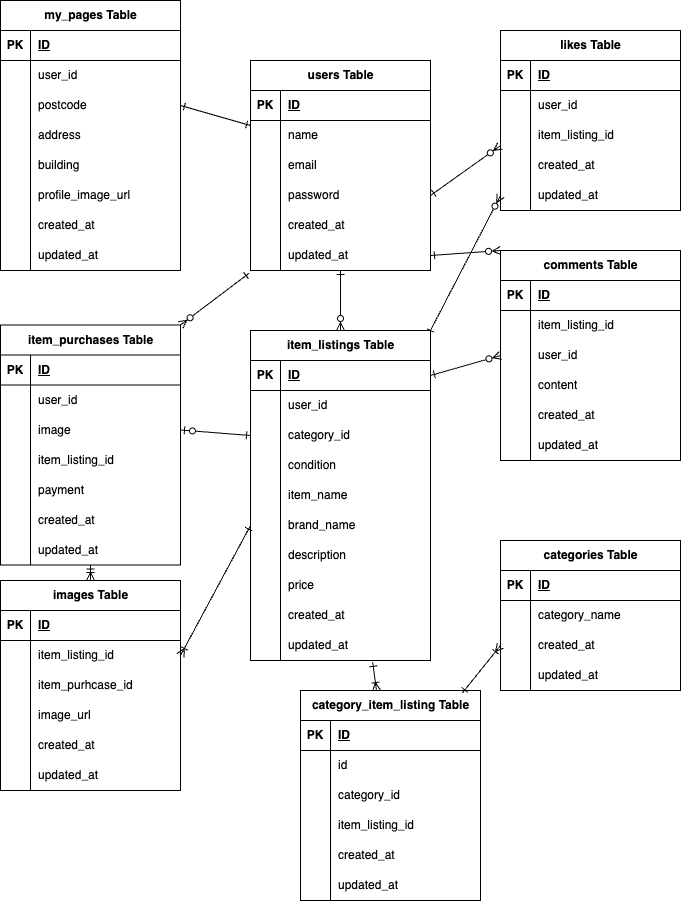

<h2>アプリケーション名</h2>

coachtechフリマ

<h2>環境構築</h2>

git clone git@github.com:mona12298/marketplace-app.git

cd marketplace-app

docker-compose build

docker-compose up -d

docker-compose exec php bash

composer install

.env.exampleファイルから.envを作成し、環境変数を変更

php artisan key:generate

php artisan migrate

php artisan db:seed

php artisan storage:link

<h3>テスト環境構築</h3>

docker-compose exec php bash

composer init

Package name (<vendor>/<name>) [root/www]: monami/marketplace-app

Add PSR-4 autoload mapping? Maps namespace "Monami\MarketplaceApp" to the entered relative path. [src/, n to skip]: src/

Do you confirm generation [yes]? yes

composer require --dev phpunit/phpunit

composer install

<h2>使用技術</h2>

言語: php 7.4.9

フレームワーク: Laravel 8.83.8

データベース: MySQL 8.0.26 

Docker: Docker, docker-compose

<h2>ER図</h2>

<h2>URL</h2>

開発環境：http://localhost/

phpMyAdmin：http://localhost:8080/

